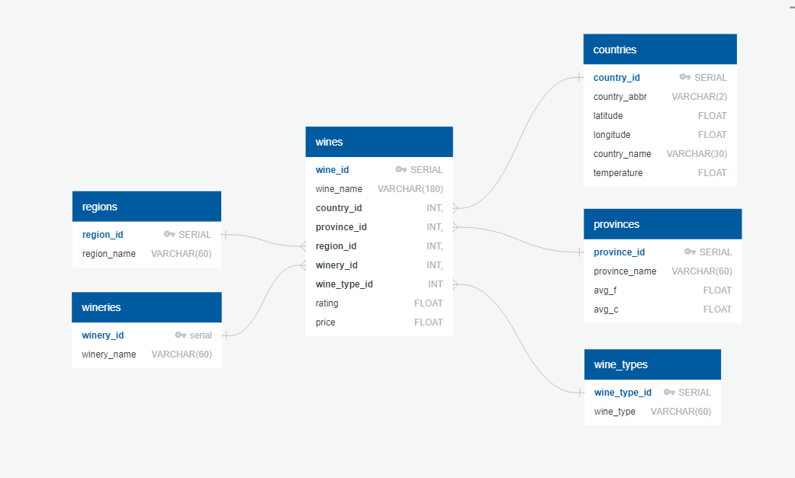
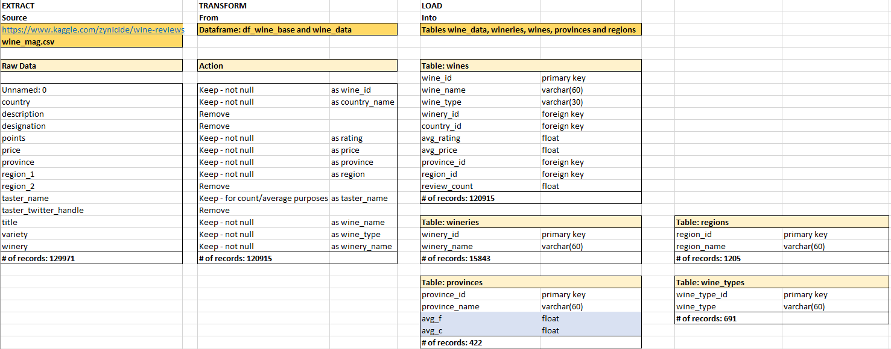
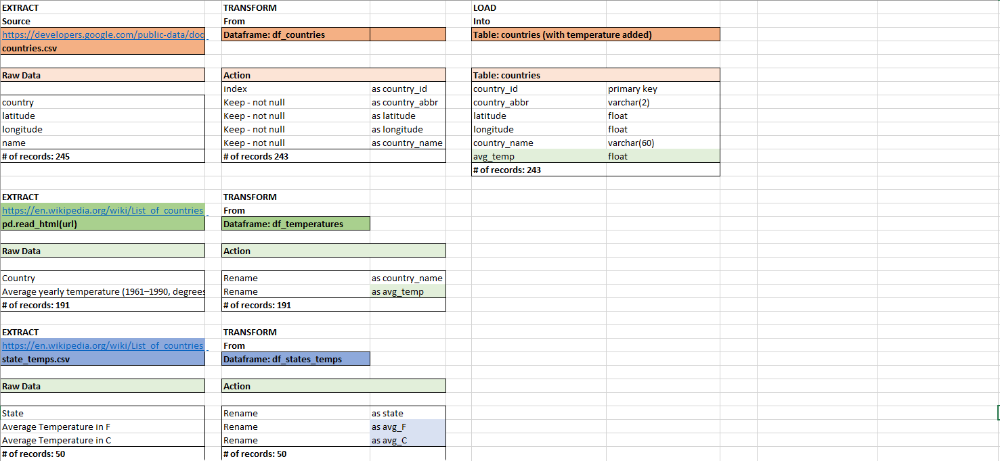

Project 2: ETL Challenge

This project was completed by Amber, Raven and Aukje.

The program will deliver a database with data about wine reviews. It has been aggregated at the 'wine-level' meaning individual review-user data has been averaged (rating and points). By adding average annual temperature information to both the provinces (=States for the United States only), or countries (all the other wines), a link can be made between the quality of the wine and the temperature. For potential plotting purposes, the longitude and latitude per country were also added.
 
The program takes 4 datasources and eventually creates a normalized database with 6 tables in PostgreSQL.

These are the steps that were taken:

1. The database schema was defined [quickdatabasediagrams.com](https://app.quickdatabasediagrams.com) as follows:

 

2. The export function was used to predefine the database in PostgresSQL (see [Create_tables_for_wine_db.sql](SQL_Files/Create_tables_for_wine_db.sql))

3. Once the database is ready, the ETL process can run. 

EXTRACT: First the following 4 data sources are loaded. Csv files can be found in the Resources folder
1. winemag.csv - [source kaggle.com](https://www.kaggle.com/zynicide/wine-reviews)
2. countries.csv - [source: wikipedia](https://en.wikipedia.org/wiki/List_of_countries_by_latitude)
3. read_html using pandas for annual temperature averages per county - [source: wikipedia](https://en.wikipedia.org/wiki/List_of_countries_by_average_yearly_temperature) 
4. state_temps.cvs - [source: www.currentresults.com](https://www.currentresults.com/Weather/US/average-annual-state-temperatures.php)

TRANSFORM:
1. Wines:
* remove all unnecessary columns (from datasource 1)
* small data cleanup within the region_name column
* drop any rows that have data missing (NaN values) >> df_wine_base
* group remaining fields by unique wine and average price and rating >> df_wine_data
2. Countries:
* add average temperature per country when found to df_countries dataframe (combine datasource 3 with 2)
* create unique country_id's
3. Wineries:
* create unique df_wineries dataframe from df_wine_base with winery_id for lookup
4. Provinces:
* create unique df_provinces dataframe from df_wine_base with province_id for lookup
* add average temperature in Fahrenheit and Celcius for every state (=provence) in the united states to df_provinces
5. Regions:
* create unique df_regions dataframe from df_wine_base with region_id for lookup
6. Wine_types:
* create unique df_wine_types dataframe from df_wine_base with wine_type_id for lookup	
		
Finally merge df_wine_base with 5 other dataframes, adding country_id, winery_id, province_id, region_id, wine_type_id as new columns.
Remove country_name, winery_name province_name, region_name and wine_type from df_wine_data, leaving only foreign keys in place!

LOAD: Since the tables have been precreated in postgreSQL, loading of the data can happen only once (or primary keys will be violated). A test query combining all 6 tables shows it worked correctly.

For the full picture see below:
 
 

